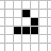
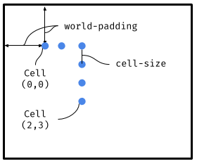

## Game of Life display <!-- omit in toc -->

In this part of the project, we'll implement enough code to display
a world state as part of our implementation of
[Conway's Game of Life](game-of-life.html) in Racket.

There will be a fair bit of set up in the next section, where you'll
need to copy this code into your Racket file, but you won't have to
write anything new. After we can make some simple configurations and
random worlds, however, and then you'll get to write some code
to implement the drawing of a world.

 Look for the Racket icon, which
we'll use to mark steps you need to complete.

- [The world state and examples](#the-world-state-and-examples)
- [Building a random state and testing unknown orders](#building-a-random-state-and-testing-unknown-orders)
- [Drawing a world](#drawing-a-world)
  - [Step 1: `place-cell`](#step-1-place-cell)
  - [Step 2:`draw-world`](#step-2draw-world)

## The world state and examples

As discussed on [the overview page](game-of-life.html), our `big-bang`
world state will be a list of
the "live" cells in the world, where each cell is just going to be
a `posn` holding the the x- and y-coordinates of that cell on the
grid. So a world is a list of `posn`s, where each `posn` contains two numbers:

```racket
;   live-cell: posn
;   world: [posn]
```

> I'm going to use `[x]` as a shorthand for `list-of-x` for some
> type `x`. So `[posn]` is shorthand for `list-of-posn`, i.e.,
>
> ```racket
> A list-of-posn is one of:
> - '()
> - (cons posn list-of-posn) 
> ```

So we have some examples that will be useful in testing, here are world states
that represent the _block_, _blinker_, and _glider_ configurations
mentioned earlier.

```racket
(define block
  (list (make-posn 0 0)
        (make-posn 0 1)
        (make-posn 1 0)
        (make-posn 1 1)))

(define blinker
  (list (make-posn 0 0)
        (make-posn 0 1)
        (make-posn 0 2)))

(define glider
  (list (make-posn 1 0)
        (make-posn 2 1)
        (make-posn 0 2)
        (make-posn 1 2)
        (make-posn 2 2)))
```

These correspond to , , and  respectively.

You'll want to copy these into your code since they'll be useful for
testing as we move forward.

## Building a random state and testing unknown orders

To "see things happen" it's useful to be able to create a random world.
Rather than have you do that, I'm just going to provide you with code
for that. Again, you'll want to copy this into your Racket file so you
can use it to display random world states.

We'll start with a function `make-all-cells` that creats all the
posns in the given range. This is a fairly complex use of `apply`,
`build-list` and multiple `lambda`s, so definitely ask questions if
you're not clear what's happening here.

```racket
; make-all-cells makes a list of all the (x, y)
; pairs where x and y are in the range [0, x-max - 1]
; and [0, y-max - 1] respectively.
; make-all-cells: number, number -> [posn]
(define (make-all-cells x-max y-max)
  (apply append
         (build-list
          x-max
          (lambda (x)
            (build-list
             y-max
             (lambda (y) (make-posn x y)))))))
```

To test `make-all-cells` is a little tricky, because we don't want
the test to be tied to a particular _ordering_ of the cells returned
by `make-all-cells`. The definition above returns the cells in
some particular order, but there's nothing special about _that_ ordering,
and any other ordering would also be correct. This will be true for many
functions as we move forward, so it'll useful to solve this problem now.

A standard approach is to _sort_ the lists that we get so we know what
order they're in. If, for example, we have a team of three people,
Sally, Chris, and Pat, and we ask for a list of their names, we could
get any of a number of orders for their names. If we sort the list we
get, though, then there should be exactly one result:

```racket
(list "Chris" "Pat" "Sally")
```

So here we'll take the list we get back from `make-all-cells` and sort
it using a function `posn<` (copy this one as well). We'll also sort
our list of the expected `posn`s, and have `check-expect` compare those
lists. If they have the same set of `posn`s, then sorting should ensure
that the lists match exactly and the `check-expect` should succeed.

```racket
; posn< returns #true if p comes before q in lexicographical
; (essentially alphabetic) order, i.e., if the x-coordinate
; of p is smaller than the x-coordinate for q, or they have
; the same x-coordinates and the y-coordinate of p is less
; than the y-coordinate of q.
(define (posn< p q)
  (or (< (posn-x p) (posn-x q))
      (and (= (posn-x p) (posn-x q))
           (< (posn-y p) (posn-y q)))))

(check-expect
 (sort (make-all-cells 3 3) posn<)
 (sort (list (make-posn 0 0)
             (make-posn 0 1)
             (make-posn 0 2)
             (make-posn 1 0)
             (make-posn 1 1)
             (make-posn 1 2)
             (make-posn 2 0)
             (make-posn 2 1)
             (make-posn 2 2)) posn<))
```

Now that we have `make-all-cells`, we can remove half of
those cells at random to generate a random board:

```racket
; random-world creates a list of random
; cells with x- and y-coordinates in the range
; [0, x-max - 1] and [0, y-max - 1] respectively.
; Each cell in that space has a 50% chance of being
; included in the resulting list.
; random-world: number, number -> [posn]
(define (random-board x-max y-max)
  (filter (lambda (c) (zero? (random 2)))
          (make-all-cells x-max y-max)))
```

Testing a function like `random-world` is also tricky
because the result is, by definition, random and thus
not predictable. So what we'll do here is confirm that
all the x- and y-coordinates are in the correct range:

```racket
(check-satisfied
 (random-world 10 5)
 (lambda (posns)
   (andmap (lambda (p) (and (<= 0 (posn-x p))
                            (< (posn-x p) 10)
                            (<= 0 (posn-y p))
                            (< (posn-y p) 5)))
           posns)))
```

## Drawing a world

Now that we can make some simple configurations like a block, and a
random world, we need to be able to draw it. Remember that `big-bang`
will pass our rendering function a world state, which is going to be
a list of the `posn`s of the "live" cells.

First, let's define some useful constants:

```racket
; The radius, in pixels, of a circle representing
; a "live" cell.
(define cell-radius 2)

; A little white space between cells.
(define padding 1)

; The diameter of a cell in pixels, plus the padding
; padding. Each cell's square will be cell-size by cell-size.
(define cell-size (+ padding (* 2 cell-radius)))

; The size of the rendered version of the board,
; measured in cells, not pixels.
(define board-x 100)
(define board-y 100)

; The number of blank pixels to place on each side (top, bottom,
; left, and right) around the world. This prevents the display
; of cells from running up against the edge of the scene.
(define board-padding 20)
```

### Step 1: `place-cell`


Write a function `place-cell` that places a cell on a given background
image. This should take into account the `board-padding` and the
`cell-size` in deciding on the placement of the circle representing
that cell.

Some examples:


`check-expect` tests that correspond to these two calls:

```racket
(check-expect
 (place-cell (make-posn 2 3) (empty-scene 100 100))
 (place-image
  (circle 2 "solid" "blue")
  30 35
  (empty-scene 100 100)))

(check-expect
 (place-cell (make-posn 4 0)
             (place-cell (make-posn 2 3) (empty-scene 100 100)))
 (place-image
  (circle 2 "solid" "blue")
  40 20
  (place-image
   (circle 2 "solid" "blue")
   30 35
   (empty-scene 100 100))))
```

You should copy these into your Racket file to give you a start on
your testing.

⚠️ **Note!!!** These tests are full of "magic" numbers
like 2, 30, 35, etc. These are the correct values, but your code
should _not_ be full of magic numbers like this. You should instead
use named constants like `cell-radius` and `padding` to build the
relevant numbers. If you have questions about this definitely ask
ASAP.

⚠️ I'm using the color `"blue"` for my circles, so you'll need to
use `"blue"` as well to get these tests to pass. One could argue
that I should have added another named constant for that color
instead of scattering the "magic string" `"blue"` all over the
code. Alternatively I could have written a `draw-cell` function
that encapsulates both `"solid"` and `"blue"` so they're only
in one place. Feel free to make any or all of these improvements
if you're so inclined.

To understand the math behind the numbers in the tests, it might
help to look at a diagram:



Here the center of cell (0, 0) will be

```racket
   (world-padding, world-padding)
```

since that's how far we need to shift that first cell over and down. In the write-up the value of `world-padding` is 20, so that means the center of this cell will be (20, 20).

For other cells, we want to shift over/down by multiples of `cell-size` based on the `posn-x` and `posn-y` of the cell. The x-coordinate of the center of the cell at (2, 3), for example, will be:

```racket
   world-padding + 2 * cell-size
```

Using the values given in the write-up this will be

```racket
   20 + 2 * 5 = 20 + 10 = 30
```

Similarly the y-coordinate will be

```racket
   world-padding + 3 * cell-size = 20 + 3 * 5 = 20 + 15 = 35
```

This is where the 30 and 35 come from in the first `check-expect`
for `place-cell`.

Make sure you use the named constants (e.g., `world-padding`)
and not the "raw" numbers (e.g., 20) when implementing
`place-cell`. You want to be able to change the value of things
like `world-padding` and have the whole drawing system update
accordingly.

### Step 2:`draw-world`


Write a function `draw-world` that takes a world state (i.e., a
list of `posn`s representing the live cells in that state) and
draws that world.

A simple example:


This just shows the top of the scene since the rest is empty and not
terribly informative.

A `check-expect` test corresponding to this example is:

```racket
(check-expect
 (draw-world (list (make-posn 2 3) (make-posn 4 0)))
 (place-image
  (circle 2 "solid" "blue")
  40 20
  (place-image
   (circle 2 "solid" "blue")
   30 35
   (empty-scene 540 540))))
```

⚠️ **Note!!!** Again, this is full of magic numbers that shouldn't
appear in your code. As example, where do the 540 values come from
that define the size of the background scene? Here `world-x` and
`world-y` are both 100, so we should have room for 100 cells in both
dimenions. How big is a cell? `cell-size` which, if you do the math
in its definition above, is 5 in this case. That means we need
500 by 500 pixels for the cells. If we then add 20 pixes of padding
(from `world-padding`) twice for each dimension (left and right for
the horizontal, and top and bottom for the vertical), we end up
with 540 for both dimensions. That math should be captured in your
code so that if we change, e.g., `cell-radius`, all the drawing
would update accordingly.

This is the first function that acts on a list. You can implement
this using recursion on lists, or you can use something like `foldr`
to combine the list of `posn`s into a single value, which is an image
in this case.

You can also use this to draw some of the provided patterns, e.g.,
you can draw a glider:


You should also be able to draw the block and the blinker, and any other
patterns you wish to add to your Racket file.
[The Wikipedia entry](https://en.wikipedia.org/wiki/Conway%27s_Game_of_Life)
has numerous other examples to play with if you'd like.

You can also draw random worlds:


Note that if you call `(draw-world (random-world 100 100))` you'll get
a _different_ pattern than the one above because `random-world`
generates a different, random world every time we call it.
