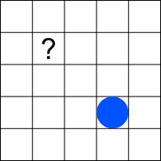
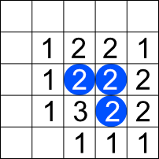

## Background <!-- omit in toc -->

In this part of the assignment, we'll implement
the idea of the _neighborhood_ of a cell, and counting
the number of neighbors that a cell has.
as part of our implementation of
[Conway's Game of Life](game-of-life.html) in Racket.
This is an
important step in our eventual determination of
whether a cell is alive or dead in the next generation.

There will definitely be more functions to implement
here than in the
[previous part](game-of-life-display.html), so start
early and ask lots of questions.

I've provided a few tests for some of the problems,
but you will probably want/need to write additional
tests to handle cases that the given tests don't cover,
and to make sure you understand what a function is supposed to do.

Also, be sure to provide a description and signature
for any functions you write in this exercise. You can
probably extract the basic information for the
description from the problem statement. If you're not
sure what the signature should be for a given function,
_definitely ask_.

- [Shifting a cell/posn](#shifting-a-cellposn)
  - [Exercise 1:`shift-cell`](#exercise-1shift-cell)
  - [Exercise 2: `shift-cell-list`](#exercise-2-shift-cell-list)
- [Generating neighbors](#generating-neighbors)
  - [Exercise 3: `generate-neighbors`](#exercise-3-generate-neighbors)
  - [Exercise 4: `all-neighbors`](#exercise-4-all-neighbors)

## Shifting a cell/posn

A useful tool for this and several other parts of the
implementation is the idea of _shifting_ a cell or
`posn`, using another `posn` to specify how much the
x- and y-coordinates should be shifted.

Consider this test:

```racket
(check-expect
 (shift-cell
  (make-posn 3 7)
  (make-posn 2 -4))
 (make-posn 5 3))
 ```

 Here we want to shift the cell/posn (3, 7) to the right
 by 2 and up by 4 (represented by `(make-posn 2 -4)`).
 The result would then be 5 (i.e., `3 + 2`) for the new
 x-coordinate and 3 (i.e., `7 + -4`) for the
 new y-coodinate.

### Exercise 1:`shift-cell`


Write a function `shift-cell` that takes two `posn`s
and returns a new `posn` that is the result of shifting
the first by the amounts specified in the second. You
should certainly pass the test given above, but you want to also include some additional tests.

### Exercise 2: `shift-cell-list`


Write a function `shift-cell-list` that takes a _list_
of cells and a single `posn` representing the amounts to
shift by, and apply that shift to every cell in the
list.

This should pass, for example, these tests:

```racket
(check-expect
 (shift-cell-list
  (list (make-posn 5 8)
        (make-posn 9 6)
        (make-posn 3 2))
  (make-posn -2 6))
 (list (make-posn 3 14)
       (make-posn 7 12)
       (make-posn 1 8)))

(check-expect
 (shift-cell-list blinker (make-posn 3 7))
 (list (make-posn 3 7)
       (make-posn 3 8)
       (make-posn 3 9)))
```

where `blinker` is as defined in
[the previous set of exercises](game-of-life-display.html).

Make sure to provide additional tests; what, for
example, `shift-cell-list` return if the input list
is empty?

## Generating neighbors

The key action when running the Game of Life is to
determine how many live cells are neighbors of a given
cell. A natural way to do this "on paper" is to go to
each cell and count the number of live cells around it.
The problem there is that we have a potentially infinite
set of cells we could/should do this counting for, and
computers aren't good at doing something for an infinite
collection of cells in a reasonable amount of time.

As an example, consider this example:



As a human, we wouldn't bother counting the live
neighbors of the cell with the question mark, because
it's "obvious" to us that there are no live cells near
it and it's neighbor count would be zero. Computers are
pretty terrible at "obvious", though, and if we count
the neighbors for every cell, we'll probably end up
counting the neighbors for that cell as well. Worse,
we'll count the neighbors for _many_ cells (possibly
_infinitely_ many) that are nowhere close to any live
cells, which is terribly inefficient. In the example
above, only 8 cells have a live neighbor, with 16
cells (twice as many) having no live neighbors.

This suggests an alternative approach, however. Instead
of going to every cell and count its neighbors, go to
every _live_ cell and make a list of _it's_ neighbors.
We can then combine all these lists, and see which cells
appear in that list 2 or 3 times. If a cell is in the
list twice, and it's already alive, it stays alive. If
it's in the list three times, it's alive in the next
generation regardless of whether it was alive or not in
this generation. Since we're modeling the world as just
a list of the live cells, we don't need to do anything
with any cell that didn't appear in the list (like our
question mark cell above), appeared only once, or
appears more than 4 times.

Consider this example



The numbers are the number of occurrences of each
cell that is the neighbor of one of the three live
cells. Note that we haven't had to do anything for
the empty cells; they weren't adjacent to a live
cell so they never got generated in a list of
neighbors.

Given this list of cells and counts, we can

- Ignore all the cells with counts 1.
- Make any cell with a count of 3 live, regardless of
  whether it's currently alive or not.
- Keep any live cells with a count of 2 alive.

That would then lead to the following state:


### Exercise 3: `generate-neighbors`


Write a function `generate-neighbors` that takes a
cell/posn and returns a list of cells/posns that are
the neighbors of the given cell.

This should, for example, pass the following tests:

```racket
(check-expect
 (sort (generate-neighbors (make-posn 7 3)) posn<)
 (sort (list (make-posn 6 2)
             (make-posn 6 3)
             (make-posn 6 4)
             (make-posn 7 2)
             (make-posn 7 4)
             (make-posn 8 2)
             (make-posn 8 3)
             (make-posn 8 4)) posn<))
(check-expect
 (sort (generate-neighbors (make-posn 0 0)) posn<)
 (sort (list (make-posn 1 1)
             (make-posn 1 0)
             (make-posn 1 -1)
             (make-posn -1 1)
             (make-posn -1 0)
             (make-posn -1 -1)
             (make-posn 0 1)
             (make-posn 0 -1)) posn<))
```

(Note the use of `sort` here so that the tests will pass
if you return the correct `posn`s regardless of their
order.)

There are many reasonable ways you can do this.
One is to generate a list of eight `posn`s representing
the eight offsets from a given cell, and then use
the `shift-cell-list` function you just wrote to apply
all those to the given cell. You can do that with `map`
in a nice way, or you can use explicit recursion if
you prefer.

### Exercise 4: `all-neighbors`


Write a function `all-neighbors` that takes a world
state (a list of cells/posns) and retuns a new list
of cells/posns that is all the neighbors of every
cell in the given world state. Note that some cells
may appear multiple times in the list; this is
desirable and important.

Below is a test for a world state containing two cells
with a blank cell between them. Note that there are
several duplicates, namely `(4, 6)`, `(4, 7)`, and
`(4, 8)`, each of which is a neighbor of both the
cells in the given world state.

```racket
(check-expect
 (sort
  (all-neighbors
   (list (make-posn 3 7)
         (make-posn 5 7))) posn<)
 (sort
  (list
   ; Neighbors of (make-posn 3 7)
   (make-posn 2 6)
   (make-posn 2 7)
   (make-posn 2 8)
   (make-posn 3 6)
   (make-posn 3 8)
   (make-posn 4 6)
   (make-posn 4 7)
   (make-posn 4 8)
   ; Neighbors of (make-posn 5 7)
   (make-posn 4 6)
   (make-posn 4 7)
   (make-posn 4 8)
   (make-posn 5 6)
   (make-posn 5 8)
   (make-posn 6 6)
   (make-posn 6 7)
   (make-posn 6 8)) posn<))
```

And here's a test where the given world state is a
horizontal blinker:

```racket
(check-expect
 (sort
  (all-neighbors
   (list
    (make-posn 7 2)
    (make-posn 8 2)
    (make-posn 9 2))) posn<)
 (sort (append
        (generate-neighbors (make-posn 7 2))
        (generate-neighbors (make-posn 8 2))
        (generate-neighbors (make-posn 9 2)))
       posn<))
```

There's a nice solution to this using `map` and
`apply append`. Or you could do it with one of the `fold`
functions. Or you could use explicit recursion. So many
options!
